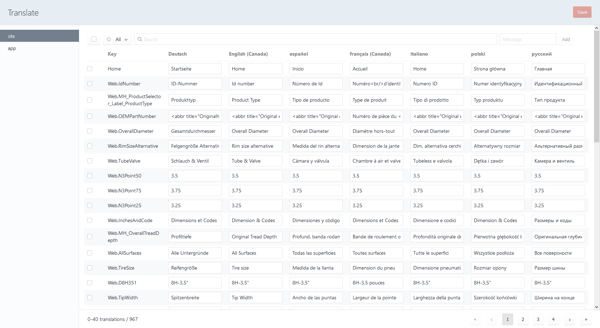

# Translate plugin for Craft CMS

This plugins adds a control panel interface to edit your static translations in the database. 



## Features

- Edit your translations for each language side by side.
- Filter missing translations and search by keywords.
- Configure which translations categories you'll be able to edit.
- Translations will be kept inside your database instead of PHP files.
- When a page is visited on the site, missing translations will automatically be added.
- Add or delete translations in the control panel.
- On installation, your existing PHP site translations will be migrated to your database.
- Export your translations in a CSV file.

## Requirements

This plugin requires Craft CMS 3.1.0 or later.

## Installation

Install the plugin via the **Plugin Store** or by command line:
```
composer require mutation/translate
php craft install/plugin translate
```

You can now edit your translations in the control panel `/admin/translate`.

## Permissions

You have special permissions for the Translate plugin:
- Update translations
- Export translations

## Settings

To configure the source message categories you want to have in your database and control panel, add values to the `categories` setting.

Missing translations will be added automatically to the database. If you want to disable this behavior, change `addMissingTranslations` to `false`

By default, missing translations are only added for site requests. To add missing translations from the control panel, change the setting `addMissingSiteRequestOnly` to `false`

Create a file `translate.php` in your `config` directory and change the settings you want, for example:
```
<?php

return [
    'categories' => [
        'site',
        'app'
    ],
    'addMissingTranslations' => false,
    'addMissingSiteRequestOnly' => false
];
```

## Roadmap

- Import translations
