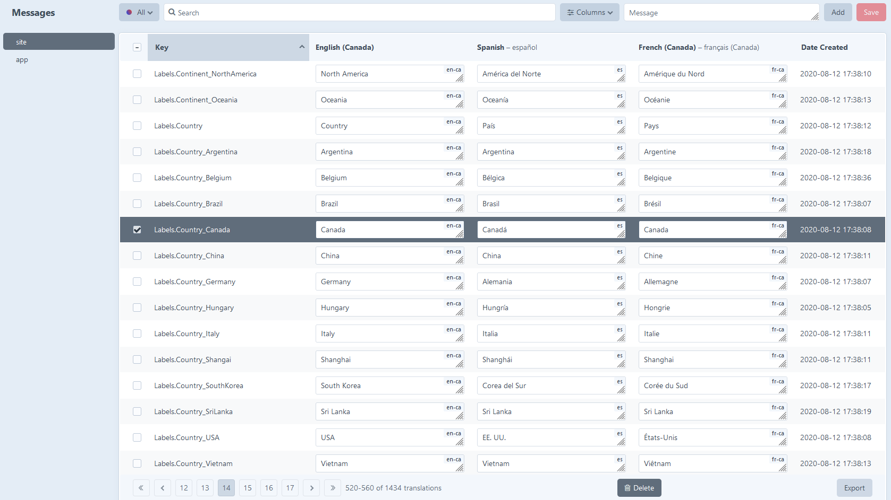

# Translations admin plugin for Craft CMS

This plugins adds a control panel interface for your clients to edit your static translations for each language side by side.



## Features

- Add, edit or delete translations in the Control Panel with each language side by side.

- Choose a category, filter by missing translations, search by keywords and sort by key/date.

- Export all or a subset of your translations to a CSV file and import it back after translators worked on it.

- Translations will be kept inside your database instead of PHP files for a better workflow.

- Optionally, missing translations are automatically added to the database when a page is visited.

- Ability to parse your twig templates or migrate from your existing PHP translations (and export it back to PHP files).

- GraphQL support to query your translations.

## Requirements

This plugin requires Craft CMS 4.0.0 or later.

## Installation

Install the plugin via the **Plugin Store** or by command line:
```
composer require mutation/translate
php craft install/plugin translations-admin
```

You can now edit your translations in the control panel `/admin/translations-admin`.

## Permissions

You have special permissions for the Translations admin plugin:
- Save translations
- Add translations
- Delete translations
- Update translations
- Export translations
- Import translations
- Use translations utilities
- Change translations settings

## Settings

You can either go the **settings page** or create a file `translations-admin.php` in your `config` directory.

- **Plugin Name**: How the plugin should be named in the CP
- **Categories**: Choose the source message categories you want to have in your database and control panel.
- **Add missing translations**: Controls whether missing translations are automatically added to the database when a page is visited.
- **Add missing translations for site request only**: Controls whether missing translations are only added when the request is from the site.
- **Excluded Messages**: Messages that should not be added to the database, identified by the start of the string (basic matching, no regex — see example).

Config file example:
```
<?php

return [
    'pluginName' => 'Translations',
    'categories' => [
        ['category' => 'site'],
        ['category' => 'app']
    ],
    'addMissingTranslations' => false,
    'addMissingSiteRequestOnly' => false,
    'excludedMessages' => [
        'Submission triggered for',
        'Submission marked as spam'
    ]
];
```

## GraphQL

Query static messages this way:
```
{
  staticMessages(language:["en-CA", "fr-CA"], category: ["site", "app"]) {
    key
    message
    language
    category
    dateCreated
  }
}
```

## Events

You can use these custom events in your plugin or module to do any actions after translations are added, saved or deleted (example: empty the cache):
```
use mutation\translate\services\MessagesService;

Event::on(MessagesService::class, MessagesService::EVENT_AFTER_SAVE_MESSAGES, function (Event $e) { ... });
Event::on(MessagesService::class, MessagesService::EVENT_AFTER_ADD_MESSAGE, function (Event $e) { ... });
Event::on(MessagesService::class, MessagesService::EVENT_AFTER_DELETE_MESSAGES, function (Event $e) { ... });
```

## Methods

You can create a new translation programmatically (in migrations or otherwise):
```PHP
use mutation\translate\Translate as TranslatePlugin;
...
TranslatePlugin::getInstance()->messages->addMessage("Lorem ipsum", "site");
```
The second parameter is the category (site, app, etc.)
